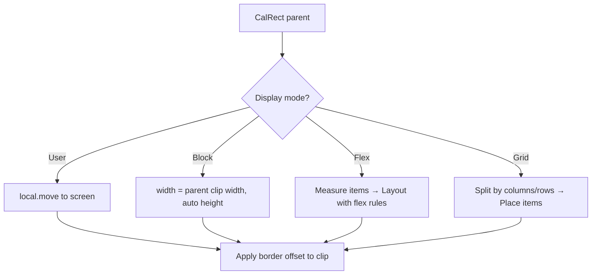

# Display Layout Modes

`Win::CalRect()` 根據 `Display_` 模式計算子視窗的 `screen` 和 `clip`。

## 概覽

| Mode | 寬度 | 高度 | 說明 |
|------|------|------|------|
| `User` | 使用者指定 | 使用者指定 | 完全手動控制位置與大小 |
| `Block` | 繼承父層 clip 寬度 | 依內容自動計算 | 類似 HTML block，佔滿整行 |
| `Flex` | 可配置 | 可配置 | 彈性佈局，支援排列、對齊、換行 |
| `Grid` | 依欄位分配 | 依列分配 | 表格化佈局 |

---

## Display_User

使用者明確指定 `local.x, y, width, height`。

```text
Win {
    local 10 5 30 15   # x=10, y=5, x2=30, y2=15 (screen-relative to parent clip)
}
```

**CalRect 行為：**
- `screen = local.move(parent->clip.x, parent->clip.y)` — 將 local 座標轉換為螢幕座標
- `clip = screen`（無 border）或 `screen.expand(-1,-1)`（有 border）

---

## Display_Block

子視窗佔滿父層 clip 的**全部寬度**，高度由內容決定。

```text
Parent (clip: x=0, y=0, w=40, h=20)
┌──────────────────────────────┐
│ Block A                      │ ← 寬度 = parent.clip.width()
│                              │   高度 = 內容所需行數
├──────────────────────────────┤
│ Block B                      │ ← 接在 A 下方
└──────────────────────────────┘
```

**CalRect 行為：**
- `screen.x = parent->clip.x`
- `screen.y` = 前一個 sibling 的 `screen.y2 + 1`（第一個為 `parent->clip.y`）
- `screen.x2 = parent->clip.x2`（佔滿整行）
- `screen.y2` = 依內容計算高度，或使用者指定的固定高度

**適用場景：** Label、段落文字、表單區塊。

---

## Display_Flex

彈性佈局，類似 CSS Flexbox。父層為 flex container，子視窗為 flex items。

### 屬性規劃

| 屬性 | 預設值 | 說明 |
|------|--------|------|
| `flex_direction` | `Row` | `Row` / `Column` — 主軸方向 |
| `flex_wrap` | `NoWrap` | `NoWrap` / `Wrap` — 是否換行 |
| `justify_content` | `Start` | `Start` / `Center` / `End` / `SpaceBetween` — 主軸對齊 |
| `align_items` | `Stretch` | `Start` / `Center` / `End` / `Stretch` — 交叉軸對齊 |
| `flex_grow` | `0` | 子視窗的伸展比例（int） |
| `flex_shrink` | `1` | 子視窗的收縮比例（int） |
| `flex_basis` | `Auto` | 子視窗基礎大小（-1 = Auto，依內容計算） |

### Row 方向範例

```
Parent (clip: w=40, h=5)
┌──────────────────────────────┐
│ [Btn A]    Label       [Btn B] │ ← justify=SpaceBetween
└──────────────────────────────┘
```

### Column 方向範例

```
Parent (clip: w=20, h=15)
┌──────────────────┐
│ Header           │ ← flex_basis = 2
├──────────────────┤
│ Content          │ ← flex_grow = 1（佔滿剩餘空間）
│                  │
│                  │
├──────────────────┤
│ Footer           │ ← flex_basis = 1
└──────────────────┘
```

### CalRect 行為

**兩階段計算：**

1. **Measure 階段** — 遍歷所有子視窗，收集每個 item 的 `flex_basis`、`flex_grow`、`flex_shrink`
2. **Layout 階段** — 根據剩餘空間分配大小並設定位置

```cpp
// Pseudocode for Row direction:
int total_basis = sum(item.flex_basis) + gap * (count - 1);
int remaining   = parent_clip.width() - total_basis;

if (remaining > 0 && has_grow_items) {
    // Distribute extra space to grow items
    int grow_total = sum(item.flex_grow for items with flex_grow > 0);
    for each item:
        if (item.flex_grow > 0)
            item_width += remaining * item.flex_grow / grow_total;
}
else if (remaining < 0 && has_shrink_items) {
    // Shrink items proportionally
    ...
}
```

---

## Display_Grid

表格化佈局，將父層 clip 分割為欄位和列。

### 屬性規劃

| 屬性 | 預設值 | 說明 |
|------|--------|------|
| `grid_columns` | `"*"` | 欄寬定義，如 `"10 * 20"`（固定+彈性） |
| `grid_rows` | `"auto"` | 列高定義，如 `"5 auto 5"` |
| `column_gap` | `0` | 欄間距 |
| `row_gap` | `0` | 列間距 |

### 範例

```
Parent (clip: w=40, h=10)
grid_columns "8 * 8"   # 左欄固定8，中欄彈性，右欄固定8
grid_rows    "3 auto"

┌────────┬───────────────┬────────┐
│ Label  │ Content Area  │ Btn    │ ← row 0, height=3
│        │               │        │
├────────┼───────────────┼────────┤
│ Nav    │ Main          │ Aside  │ ← row 1, auto (剩餘高度)
│        │               │        │
└────────┴───────────────┴────────┘
```

### 欄/列定義語法

| 值 | 說明 |
|----|------|
| `*` | 彈性，均分剩餘空間（1份） |
| `2*` | 彈性，佔2份 |
| `N`（數字） | 固定大小 N |
| `auto` | 依內容自動計算 |

### CalRect 行為

```cpp
// Pseudocode:
int total_fixed = sum(fixed column widths) + gap * (col_count - 1);
int remaining   = parent_clip.width() - total_fixed;
int star_total  = sum(star fractions);

for each column:
    if fixed:     col_width = N;
    else if auto: col_width = max_content_width;
    else if star: col_width = remaining * fraction / star_total;
```

---

## CalRect 流程



---

## 實作順序建議

1. **Block** — 最簡單，只需追蹤 sibling 的 Y 偏移
2. **Flex (Row, NoWrap)** — 先支援基本水平排列 + `flex_grow`
3. **Flex (Column)** — 垂直方向
4. **Flex (Wrap + justify/align)** — 完整 flexbox
5. **Grid** — 最後實作，最複雜

---

## 與現有程式碼的整合

- `Win` 新增 `display_mode`、`flex_grow`、`flex_basis` 等屬性
- `CalRect(Win* parent)` 根據 `parent->display_mode` 決定計算方式
- `local` rect 在 User 模式下仍為絕對位置；在其他模式下可作為 flex_basis / grid placement 的參考
- `clip` 的計算邏輯不變（border offset）
