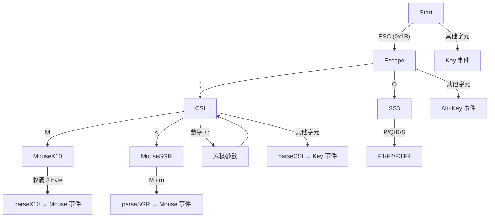

# VT/ANSI Escape Sequence 說明

本文檔說明 `VTParser` 所處理的各種終端控制碼（VT100 / ANSI escape sequences），涵蓋鍵盤、滑鼠與貼上模式。

## 目錄

- [總覽](#總覽)
- [狀態機](#狀態機)
- [普通鍵與 Ctrl 組合](#普通鍵與-ctrl-組合)
- [Alt + Key](#alt--key)
- [SS3 序列（F1–F4）](#ss3-序列f1f4)
- [CSI 序列](#csi-序列)
  - [方向鍵與功能鍵](#方向鍵與功能鍵)
  - [Modifier 編碼](#modifier-編碼)
  - [括號貼上模式](#括號貼上模式)
- [X10 滑鼠報文](#x10-滑鼠報文)
- [SGR 滑鼠報文](#sgr-滑鼠報文)
- [完整序列速查表](#完整序列速查表)

---

## 總覽

VT（Video Terminal）/ ANSI escape sequence 是終端機用來傳遞鍵盤、滑鼠等輸入事件的標準協定。`VTParser` 將原始位元組流解析為結構化的 `Event`，支援以下類別：

| 類別 | 事件類型 | 說明 |
|---|---|---|
| 普通鍵 | `EventType::Key` | 一般按鍵、Ctrl 組合 |
| Alt + Key | `EventType::Key` | ESC 後接非 `[` / `O` 的字元 |
| SS3 | `EventType::Key` | F1–F4（`\eOP` ~ `\eOS`）|
| CSI | `EventType::Key` | 方向鍵、Home/End、PageUp/PageDown、Delete、Insert |
| X10 Mouse | `EventType::Mouse` | 基本滑鼠報文（`\e[M...`）|
| SGR Mouse | `EventType::Mouse` | 進階滑鼠報文，支援 Modifier（`\e[<...M/m`）|
| Bracketed Paste | `EventType::Paste` | 括號貼上模式 |

---

## 狀態機

`VTParser` 使用有限狀態機解析輸入流。每個字元觸發狀態轉移：



### 狀態說明

| 狀態 | 觸發條件 | 後續行為 |
|---|---|---|
| `Start` | 初始/閒置 | 收到 ESC 進入 Escape；否則產生 Key 事件 |
| `Escape` | 收到 `ESC (0x1B)` | `[` → CSI；`O` → SS3；其他 → Alt+Key |
| `CSI` | 收到 `\e[` | 累積參數直到終止字元，呼叫 `parseCSI()` |
| `SS3` | 收到 `\eO` | 讀取下一個字元，映射 F1–F4 |
| `MouseX10` | 收到 `\e[M` | 收集 3 byte 後呼叫 `parseX10()` |
| `MouseSGR` | 收到 `\e[<` | 直到 `M`/`m`，呼叫 `parseSGR()` |
| `BracketedPaste` | 收到 `\e[200~` | 收集內容直到 `\e[201~`，產生 Paste 事件 |

---

## 普通鍵與 Ctrl 組合

在 `Start` 狀態下，非 ESC 字元直接視為 Key 事件。特殊處理如下：

| 輸入位元組 | 解析結果 | 說明 |
|---|---|---|
| `0x20` ~ `0x7E`（可列印字元） | `key = c`, `ctrl = false` | 普通按鍵 |
| `0x00` (NUL) | `key = ' '`, `ctrl = true` | Ctrl+Space（Unix 下產生 NUL）|
| `0x01` ~ `0x1A`（排除 8,9,10,13,27） | `key = c + 96`, `ctrl = true` | Ctrl+A ~ Ctrl/Z |

### Ctrl 編碼規則

Unix 終端機中，Ctrl+字母會產生對應的 Control Code：

```
Ctrl+A → 0x01 (SOH)
Ctrl+B → 0x02 (STX)
...
Ctrl+Z → 0x1A (SUB)
```

`VTParser` 將這些值加 96（即 `c + 'a' - 1`）映射回原始字母：

| Control Code | 解析為 |
|---|---|
| `0x01` | Ctrl+a |
| `0x02` | Ctrl+b |
| ... | ... |
| `0x1A` | Ctrl+z |

**排除的字元**：
- `0x08` (BS) — 退格鍵，不視為 Ctrl+H
- `0x09` (HT) — Tab 鍵，不視為 Ctrl+I
- `0x0A` (LF) — Enter/換行，不視為 Ctrl+J
- `0x0D` (CR) — 回車，不視為 Ctrl+M
- `0x1B` (ESC) — Escape，進入序列解析

---

## Alt + Key

當收到 ESC 後接非 `[` / `O` 的字元時，解析為 Alt 組合鍵：

| 原始位元組 | 解析結果 |
|---|---|
| `\e a` (0x1B, 'a') | `key = 'a'`, `alt = true` |
| `\e 1` (0x1B, '1') | `key = '1'`, `alt = true` |

---

## SS3 序列（F1–F4）

SS3（Single Shift 3，`\eO`）用於部分終端機的 F1–F4：

| 原始位元組 | 解析結果 | key 值 |
|---|---|---|
| `\eOP` (0x1B, 'O', 'P') | F1 | 1011 |
| `\eOQ` (0x1B, 'O', 'Q') | F2 | 1012 |
| `\eOR` (0x1B, 'O', 'R') | F3 | 1013 |
| `\eOS` (0x1B, 'O', 'S') | F4 | 1014 |

> **注意**：部分終端機（如 xterm）的 F5–F8、F9–F12 使用 CSI 序列（見下方），而非 SS3。

---

## CSI 序列

CSI（Control Sequence Introducer，`\e[`）是最常見的 escape sequence 類型。格式為：

```
\e[ p1 ; p2 cmd
```

- `p1` — 主要參數（預設 1），用於識別按鍵
- `p2` — Modifier 參數（預設 1），用於 Shift/Alt/Ctrl
- `cmd` — 終止字元，決定事件類型

### 方向鍵與功能鍵

| cmd | p1 | 解析結果 | key 值 |
|---|---|---|---|
| `A` | — | Up（上） | 1065 |
| `B` | — | Down（下） | 1066 |
| `C` | — | Right（右） | 1067 |
| `D` | — | Left（左） | 1068 |
| `Z` | — | Shift+Tab | 9 (Tab) + shift |
| `H` | — | Home | 1003 |
| `F` | — | End | 1004 |
| `~` | 2 | Insert | 1006 |
| `~` | 3 | Delete | 1005 |
| `~` | 5 | PageUp | 1001 |
| `~` | 6 | PageDown | 1002 |
| `~` | 200 | Bracketed Paste Start | —（進入貼上模式）|

### Modifier 編碼

CSI 序列的 `p2` 參數使用位元編碼表示 Modifier：

```
p2 = 1 + (Shift ? 1 : 0) + (Alt ? 2 : 0) + (Ctrl ? 4 : 0)
```

| p2 | Shift | Alt | Ctrl | 說明 |
|---|---|---|---|---|
| 1 | — | — | — | 無 Modifier |
| 2 | ✓ | — | — | Shift |
| 3 | — | ✓ | — | Alt |
| 4 | ✓ | ✓ | — | Shift+Alt |
| 5 | — | — | ✓ | Ctrl |
| 6 | ✓ | — | ✓ | Shift+Ctrl |
| 7 | — | ✓ | ✓ | Alt+Ctrl |
| 8 | ✓ | ✓ | ✓ | Shift+Alt+Ctrl |

### 實際序列範例

```
\e[A          → Up（無 Modifier）
\e[1;2A       → Shift+Up
\e[1;3A       → Alt+Up
\e[1;5A       → Ctrl+Up
\e[1;6A       → Shift+Ctrl+Up
\e[D          → Left（無 Modifier）
\e[1;5D       → Ctrl+Left
\e[5~         → PageUp（無 Modifier）
\e[5;2~       → Shift+PageUp
```

### 括號貼上模式

Bracketed Paste Mode 讓終端機在貼上時包裹特殊序列，避免貼上的內容被誤認為按鍵輸入。

**啟用方式**：輸出 `\e[?2004h`（由應用程式控制）

| 序列 | 作用 |
|---|---|
| `\e[200~` | 貼上開始 — 進入 `BracketedPaste` 狀態，後續字元收集到 `paste_buffer_` |
| `\e[201~` | 貼上結束 — 產生 `EventType::Paste` 事件，內容為 `paste_text` |

**工作流程**：

```
使用者貼上 "hello world"
    ↓
終端機輸出: \e[200~ h e l l o   w o r l d \e[201~
    ↓
VTParser 解析:
  - \e[200~ → 進入 BracketedPaste
  - "hello world" → 收集到 paste_buffer_
  - \e[201~ → 產生 Paste 事件，paste_text = "hello world"
```

**內部偵測機制**：

在 `BracketedPaste` 狀態下，解析器逐字元檢查是否為結束序列 `\e[201~`：

| paste_escape_state_ | 等待的字元 | 說明 |
|---|---|---|
| 0 | — | 正常收集模式 |
| 1 | `[` | 收到 ESC，可能是結束序列的開頭 |
| 2 | `2` | 確認 CSI + 數字 2 |
| 3 | `0` | 確認 "20" |
| 4 | `1` | 確認 "201" |
| 5 | `~` | 確認 "201~"，結束貼上 |

若中途不匹配（例如使用者在貼上的文字中包含 ESC），則將已收集的 escape buffer 合併回 paste_buffer_，繼續收集。

---

## X10 滑鼠報文

X10 是最基本的滑鼠追蹤模式。格式為：

```
\e[M b x y
```

- `b` = button + 32（按鈕編碼）
- `x` = column + 32（欄位，從 1 開始）
- `y` = row + 32（列，從 1 開始）

### 按鈕編碼

| b & 0x3F | 解析結果 |
|---|---|
| 0 | Button 0（左鍵按下/移動）|
| 1 | Button 1（中鍵按下/移動）|
| 2 | Button 2（右鍵按下/移動）|
| 3 | Mouse Release（放開）|
| 64 | Scroll Up |
| 65 | Scroll Down |

### 座標計算

```
event.x = x - 1   // 0-based column
event.y = y - 1   // 0-based row
event.button = b & 3
if (b & 64) event.button = (b & 65) == 64 ? 64 : 65  // Scroll
```

### 範例

```
\e[M 176 98 66   → b=0x30(48), x=0x62(98), y=0x42(66)
                  → button = 0, x = 97-1=96, y = 65-1=64
```

> **限制**：X10 不支援 Modifier（Shift/Alt/Ctrl），座標上限為 223（因為 223+32=255，超過會溢位）。

---

## SGR 滑鼠報文

SGR（Select Graphic Rendition）是進階滑鼠追蹤模式。格式為：

```
\e[< b ; x ; y M    // 按下/移動
\e[< b ; x ; y m    // 放開
```

- `b` — 按鈕編碼（含 Modifier）
- `x` — column（從 1 開始）
- `y` — row（從 1 開始）
- `M` — 按下或移動事件
- `m` — 放開事件（解析為 button = 3）

### 按鈕編碼（含 Modifier）

```
b & 0x03   → Button (0=左, 1=中, 2=右)
b & 0x04   → Shift
b & 0x08   → Alt
b & 0x10   → Ctrl
```

| b 的位元 | 含義 |
|---|---|
| bit 0-1 (`b & 3`) | Button: 0=左, 1=中, 2=右 |
| bit 2 (`b & 4`) | Shift |
| bit 3 (`b & 8`) | Alt |
| bit 4 (`b & 16`) | Ctrl |

### 座標計算

```
event.x = x - 1   // 0-based
event.y = y - 1   // 0-based
event.shift = (b & 4) != 0
event.alt   = (b & 8) != 0
event.ctrl  = (b & 16) != 0
```

### 範例

```
\e[<0;100;50M    → Button 0, x=99, y=49（無 Modifier）
\e[<32;100;50M   → b=32(0x20), button=0, Ctrl=true
\e[<6;100;50M    → b=6(0x06), button=2, Shift=true
\e[<0;100;50m    → Release 事件（button = 3）
```

> **優勢**：SGR 支援 Modifier、無座標上限限制，是目前推薦的滑鼠追蹤模式。

### Motion（移動）事件

X10 和 SGR 都使用按鈕編碼的 bit 5（值 32）來區分「按下」與「移動」：

| b & 32 | 含義 |
|---|---|
| 0 | Button press / release |
| 32 | Mouse motion（按住滑鼠拖曳時產生）|

X10 中 `b & 64` 用於滾輪，而 SGR 的 bit 5 則用於 motion。在 X10 裡，motion 和 scroll 共用同一個位元，所以 X10 無法同時支援 motion 與 scroll。

### Double-Click / Triple-Click

**VT/ANSI 協定本身沒有專屬的 double-click 或 triple-click 編碼。**

終端機只會送出連續的單次點擊事件：

```
第一次點擊: \e[<0;100;50M    → button=0, press
放開:       \e[<0;100;50m    → release
第二次點擊: \e[<0;100;50M    → button=0, press（時間間隔很短）
放開:       \e[<0;100;50m    → release
```

Double-click 的判斷必須由 **應用程式層** 自行實作：

1. 記錄上次點擊的時間與座標
2. 當新的點擊事件到達時，檢查時間間隔是否小於系統定義的 double-click 閾值（通常 ~500ms）
3. 同時檢查座標是否在允許的範圍內（某些系統要求兩次點擊在同一位置或鄰近區域）
4. 若符合條件，則將第二次點擊視為 double-click

> **注意**：`VTParser` 目前不支援 double-click 偵測。若需要此功能，需在 `Terminal` 層或應用程式層實作時間間隔判斷邏輯。

---

## 完整序列速查表

### 鍵盤序列

| 按鍵 | 原始位元組 | key 值 |
|---|---|---|
| Up | `\e[A` | 1065 |
| Down | `\e[B` | 1066 |
| Right | `\e[C` | 1067 |
| Left | `\e[D` | 1068 |
| Home | `\e[H` | 1003 |
| End | `\e[F` | 1004 |
| PageUp | `\e[5~` | 1001 |
| PageDown | `\e[6~` | 1002 |
| Delete | `\e[3~` | 1005 |
| Insert | `\e[2~` | 1006 |
| Shift+Tab | `\e[Z` | 9 + shift |
| F1 | `\eOP` | 1011 |
| F2 | `\eOQ` | 1012 |
| F3 | `\eOR` | 1013 |
| F4 | `\eOS` | 1014 |

### Modifier 組合範例（以 Up 為例）

| 按鍵 | 原始位元組 |
|---|---|
| Shift+Up | `\e[1;2A` |
| Alt+Up | `\e[1;3A` |
| Ctrl+Up | `\e[1;5A` |
| Shift+Alt+Up | `\e[1;4A` |
| Shift+Ctrl+Up | `\e[1;6A` |
| Alt+Ctrl+Up | `\e[1;7A` |
| Shift+Alt+Ctrl+Up | `\e[1;8A` |

### 滑鼠序列

| 事件 | X10 格式 | SGR 格式 |
|---|---|---|
| 左鍵按下 (x,y) | `\e[M b x y`（b=32） | `\e[<0;x;yM` |
| 中鍵按下 (x,y) | `\e[M b x y`（b=33） | `\e[<1;x;yM` |
| 右鍵按下 (x,y) | `\e[M b x y`（b=34） | `\e[<2;x;yM` |
| 放開 | `\e[M b x y`（b=35） | `\e[<0;x;ym` |
| Scroll Up (x,y) | `\e[M b x y`（b=96） | — |
| Scroll Down (x,y) | `\e[M b x y`（b=97） | — |

### 貼上模式序列

| 事件 | 原始位元組 |
|---|---|
| 貼上開始 | `\e[200~` |
| 貼上結束 | `\e[201~` |
